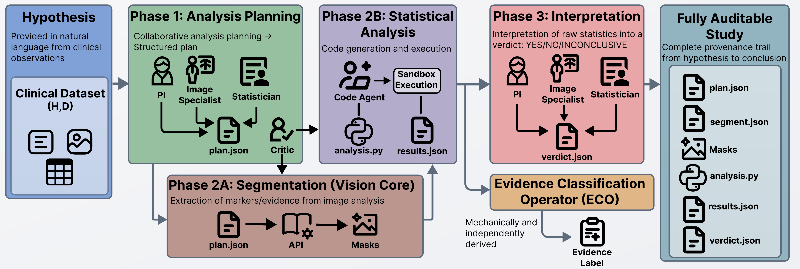

# VERITAS

**Verifiable Epistemic Reasoning for Image-Derived Hypothesis Testing via Agentic Systems**

*Lucas Stoffl, Benedikt Wiestler, Johannes C. Paetzold · [arXiv 2026](https://arxiv.org/abs/2604.12144)*

[](https://arxiv.org/abs/2604.12144)
[](LICENSE)
[](pyproject.toml)
[](example_run/)



---

VERITAS runs biomedical hypothesis tests on multi-modal datasets end-to-end: **from a natural-language question to a statistically grounded verdict, with every intermediate artifact auditable.** A team of LLM agents formulates an analysis plan, calls a medical-imaging segmentation foundation model (SAT), writes and executes statistical code in a sandbox, and delivers a verdict that a **deterministic Evidence Classification Operator (ECO)** scores against power, directionality, and effect size — no post-hoc LLM grading, no fabricated p-values.

On a 64-hypothesis benchmark (ACDC cardiac MRI + UCSF-PDGM glioma), locally-deployed VERITAS reaches **87.9% evidence-label accuracy on ACDC with zero hallucinated statistical significance**. See the [paper](https://arxiv.org/abs/2604.12144) for full results.

## Look before you install

Browse [`example_run/`](example_run/) for two complete frozen runs of the same hypothesis — agent transcripts, segmentation request, statistical code, produced plots, and the final verdict JSON. One uses small `gpt-oss` and `qwen3` models via local Ollama, the other `GPT-5.2` via OpenRouter. Both reach the same verdict. No install, no API key required to inspect them.

---

## Setup

<details open>
<summary><b>1. Install</b></summary>

```bash
git clone https://github.com/LucZot/veritas.git
cd veritas

conda create -n veritas python=3.12 -y
conda activate veritas
pip install -e ".[all]"
```
</details>

<details>
<summary><b>2. Configure MCP servers</b></summary>

```bash
cp mcp_servers.example.json mcp_servers.json
```

The default `code_execution` block works as-is. The `sat` block has `${SAT_PYTHON}` / `${SAT_REPO_PATH}` / `${SAT_CHECKPOINT_DIR}` placeholders that step 4 will fill in automatically. (If you skip step 4, you can either export those env vars or paste absolute paths in by hand.)
</details>

<details>
<summary><b>3. Code-execution MCP server (required)</b></summary>

Installs the dependencies the sandbox needs to run agent-authored statistical code. Reuses the `veritas` conda env:

```bash
bash scripts/setup_code_execution.sh
```
</details>

<details>
<summary><b>4. SAT segmentation MCP server (required for raw imaging)</b></summary>

[SAT](https://github.com/zhaoziheng/SAT) is a text-prompted medical-imaging segmentation foundation model. Only needed when running on raw imaging datasets (ACDC, UCSF-PDGM). Needs a **GPU**, a **separate conda env** (Python 3.11), and ~6.5 GB of checkpoints.

```bash
bash scripts/setup_sat.sh   # creates 'sat' env, clones SAT, installs SAT deps,
                            #   downloads checkpoints, and patches mcp_servers.json
                            #   (idempotent — re-runs skip what's already done)
```
</details>

<details>
<summary><b>5. LLM provider</b></summary>

**Ollama (local, no API key):**

```bash
# Install Ollama (see https://ollama.com), then start the daemon:
export OLLAMA_LOG_LEVEL=warn   # suppress verbose Ollama output
ollama serve &

# Pull every model used by the default config:
ollama pull gpt-oss:20b
ollama pull qwen3:8b
ollama pull qwen3-coder:30b
```

Use `experiments/configs/default_ollama_local.json`.

**OpenRouter (frontier models via API):**

```bash
export OPENROUTER_API_KEY=sk-or-...
```

Use `experiments/configs/default_openrouter_gpt52.json`.
</details>

<details>
<summary><b>6. Datasets</b></summary>

```bash
export BIO_DATA_ROOT=/path/to/your/data   # add to ~/.bashrc to make it permanent
```

Config files use `__DATA_ROOT__` as a placeholder — replaced with `$BIO_DATA_ROOT` at runtime. The SAT cache (`$BIO_DATA_ROOT/sat_cache/`) is created automatically on first run.

**ACDC** (cardiac MRI, 100 patients) — [ACDC challenge](https://www.creatis.insa-lyon.fr/Challenge/acdc/databases.html) (free registration). Extract so the tree looks like:

```
$BIO_DATA_ROOT/
└── ACDC/
    └── database/
        ├── training/
        │   ├── patient001/
        │   │   ├── patient001_4d.nii.gz
        │   │   ├── patient001_frame01.nii.gz
        │   │   └── Info.cfg
        │   │   └── ...
        │   └── ...
        └── testing/
```

**UCSF-PDGM** (brain glioma, 501 patients) — [TCIA](https://www.cancerimagingarchive.net/collection/ucsf-pdgm/) (free, no registration). Extract so the tree looks like:

```
$BIO_DATA_ROOT/
└── UCSF-PDGM/
    ├── UCSF-PDGM-v5/                    # NIfTI per patient
    │   └── UCSF-PDGM-0004_nifti/
    │   └── ...
    └── UCSF-PDGM-metadata_v5.csv
    └── ...
```

Then build the manifest:

```bash
python scripts/generate_pdgm_manifest.py --data-root $BIO_DATA_ROOT/UCSF-PDGM
```
</details>

---

## Running experiments

One hypothesis, local (Ollama):

```bash
python experiments/run_experiments.py \
  --bank experiments/tiered_hypothesis_bank.json \
  --hypotheses cardiac_01_dcm_lvef_lower \
  --n-runs 1 \
  --config experiments/configs/default_ollama_local.json \
  --output-dir results/veritas_main
```

One hypothesis, OpenRouter:

```bash
python experiments/run_experiments.py \
  --bank experiments/tiered_hypothesis_bank.json \
  --hypotheses cardiac_01_dcm_lvef_lower \
  --n-runs 1 \
  --config experiments/configs/default_openrouter_gpt52.json \
  --output-dir results/veritas_main
```

Full benchmark (64 hypotheses × 10 runs):

```bash
python experiments/run_experiments.py \
  --bank experiments/tiered_hypothesis_bank.json \
  --n-runs 10 \
  --config experiments/configs/default_ollama_local.json \
  --output-dir results/veritas_main
```

Re-evaluate an existing experiment folder offline (no LLM calls):

```bash
python experiments/evaluate_experiment_folder.py results/veritas_main/exp_YYYYMMDD_HHMMSS
```

See [experiments/README.md](experiments/README.md) for all flags, the evaluation-framework rationale, and [troubleshooting](experiments/README.md#troubleshooting).

---

## Citation

```bibtex
@article{stoffl2026veritas,
  title={VERITAS: Verifiable Epistemic Reasoning for Image-Derived Hypothesis Testing via Agentic Systems},
  author={Stoffl, Lucas and Wiestler, Benedikt and Paetzold, Johannes C},
  journal={arXiv preprint arXiv:2604.12144},
  year={2026}
}
```

We are grateful to build on [Virtual Lab](https://github.com/zou-group/virtual-lab) (Swanson et al., Nature 2025) for its agent and meeting primitives, and [SAT](https://github.com/zhaoziheng/SAT) (Zhao et al., NPJ Digital Medicine 2025) for medical-image segmentation in Phase 2A.

---

## License

Apache 2.0. See [LICENSE](LICENSE) and [NOTICE](NOTICE).
